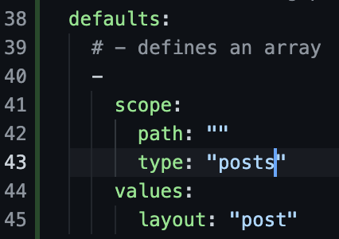
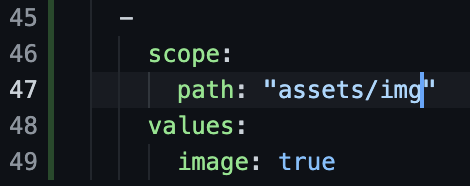

# jekyll-practice

## Getting started with first Jekyll Project

1. Prerequisites:
    1. Ruby and Gem must be installed on your machine
    2. Install jekyll using the following commamd:

        ```gem install jekyll bundler```

2. Create a new project using the following command:

    ```jekyll new <project_name>```

3. Run the project by changing pwd to the new project directory and running the following command:

    ```bundle exec jekyll serve```

## Folder Structure

1. ```_posts``` contains the blog posts for the website.

2. ```_site``` contains the jekyll compiled static website code.

3. ```_config.yml``` contains all the attributes of the website.

4. ```404.html``` contains the html code for the Server Error 404 Page.

5. ```about.markdown``` contains the about section of the website. The content is written in the markdown language.

6. ```Gemfile``` contains the gem dependencies that the jekyll project has.

7. ```index.markdown``` contains the index page markdown.

## Understanding the blog posts inside _post

1. Default file naming convention for blog posts is: ```<date>-<post-title>.markdown```

2. Each file contains front matter.

    Front Matter occupy the first few lines of every blog post. They are enclosed in ```---```. It can either be specified in YAML or JSON format. An example is shown below:

    

    It's attributes may include the following:

    1. ```layout```: Layout specifies the type of layout that the current markdown post will have. We can create our own custom layouts and specify them here.

    2. ```title```: Title overrides the title given in the filename for that markdown post.

    3. ```date```: Date overrides the date given in the filename for that markdown post. This will also change the url for that jekyll post as date is included in the post url. (Under default settings)

    4. ```categories```: Categories defines where the page will be stored in when it is compiled. Each category might define different ways of displaying the page.

    5. ```<your-own-attribute>```: You can even define your own custom front matter attribute that you can refer to in the layouts.

3. We can create sub directories in _posts to keep it organised and it won't change anything in the project.

## Creating draft posts in Jekyll

1. All drafts are saved under ```_drafts``` folder inside the project directory. You might need to create this folder.

2. By default, drafts don't show up in the served website. To see the drafts in served website add ```--drafts``` option to the jekyll serve command.

3. Drafts don't have any naming convention like posts do. So, if you don't add the date to the file, jekyll will by default pick the last updated date for that draft. The title of the draft however will be picked up from the filename if not specified in the front matter.

4. Once you are done and satisfied with the draft, you can move it to _posts folder with the naming convention used there.

## Creating pages in Jekyll

1. Pages are the pages you see on your website. Example: About, Contact me, etc.

2. The front matter must have the layout attribute set to page. ```layout: page```

3. We can also move the pages to a directory in the root folder of the project, but that will change the url for accessing that page. (It will add the ```/<folder_name>/<page_name>``` to the url)

## Permalinks in Jekyll

1. Permalinks define the permanent url that the post/page will have.

2. You can mention the permalink in the front matter for that post/page. The example of which you can see in the pages/donate post.

3. Use of this attribute is to keep a single url for the post/page, even if there's a change in the date or category attribute.

4. You can also give variables to the permalink. Example of this can be seen in the My first blog post inside _posts/my_posts.
    
    Each variable has the syntax: ```:<variable_name>```. Some of the examples are given below:

    1. :categories

    2. :title

    3. :day

    4. :month

    5. :year

## Defaults of Front Matter



1. Consider an example where you are the author of the posts 99% of the time. You would want to have a default front matter attribute author that will have your name.

2. To set default values for front matter attributes, you can head over to ```_config.yml``` for that project.

3. In the picture shown as example, following is the meaning of each attribute:

    1. ```scope```: It defines for which files/folder these defaults apply to.

    2. ```scope/path```: You need to specify the path for which the defaults are applicable. If you pass an empty string it will apply to the whole project.

    3. ```scope/type```: This defines the type of files for which the scope of defaults will be limited to. In our example the scope will be limited to the _posts folder.

    4. ```values```: Values contain the default key pair values for the front matter attributes.

4. You need to rerun the jekyll serve command in case you change the ```_config.yml``` file.

## Themes

1. Theme for a jekyll website is defined inside the _config.yml file.

2. You can search for Jekyll themes by visiting [RubyGems](https://rubygems.org) and searching for ```jekyll-theme``` in search bar.

3. For each theme, different layouts are defined. So, when you change the theme you might need to change the layout for each file in your project. These layouts can be found on the github page for those themes under the ```_layouts``` folder.

4. You can also find the documentations for the jekyll themes to structure the project according to the requirements of the theme.

## Custom layouts or Overriding existing layouts

1. You can create your layouts under the ```_layouts``` folder.

2. You can also override the existing layouts by keeping the name of the layout html same as the layout you want to override.

3. Example for this can be seen in the welcome to jekyll post. I have used a custom layout called kiki.

4. For overriding the existing layout posts, you can rename the file under _layouts posts_temp.html to posts.html and it will override the existing posts layout.

5. We can also use a wrapper layout that we can call in other layouts using front matter. For example in kiki layout, you can see that it includes the wrapper layout and for wrapper the content will be the contents in the kiki layout and wherever kiki is being used there the content will be the rendered layout from the kiki and wrapper.

## Liquid Variables in Jekyll

1. You can access the variables in jekyll layouts using liquid templating language.

2. We have already used the ```{{ content }}``` variable in kiki and wrapper layout.

3. To access the front matter attributes mentioned in the layout file use the ```layout.<attribute-name>``` syntax.

4. To access the front matter attributes mentioned in the posts use the ```page.<attribute_name>``` syntax.

5. To access the website wide variables which are defined in _config.yml use the ```site.<attribute_name>``` syntax.

6. To know more on the variables available in Jekyll refer to the documentation [page](https://jekyllrb.com/docs/variables/).

## Includes

1. You can have header and footer layouts which you can then **include** in the layouts for your jekyll website.

2. These includes can be added to the ```_includes``` folder.

3. You can call your include layouts inside the actual layouts by using the `````` syntax.

4. You can also add params to these calls. ``````.

5. To access params in the include files, use the ```include.<include_var_name>```.

## Loops and Conditions

1. For this demonstration you can refer to the ```home_test.html``` in layouts.

2. You can easily loop over multiple elements using the for loop in the layout. Please refer to the example.

3. You can use the ```if```, ```elsif``` and ```else``` statements to check conditions.

4. You can also use ```and``` and ```or``` logical operators too.

## Data Files

1. For this demonstration we will be using the ```home_data.html``` layout and data file ```data/people.yml```.

2. You can store the data files under ```_data``` folder and keep ```csv, json or yaml``` files inside that folder.

3. These files can be used by jekyll to load the layout according to the data present inside them.

4. We can access the data by using ```{{ site.data.people }}```.

## Static files

1. Any file without the front matter can be considered as static file.

2. To demonstrate this section, I will be using the folder ```assets```. You can use any name you want to. Also, I will be using ```home_assets.html``` layout.

3. You can access the static files using the ```{{ site.static_files }}``` variable.

4. It will scan the whole project for all the static files, regardless of the folder they are present in.

5. We can set the defaults for the image assets by setting the front matter in _config.yml as follows for the images folder in the project:

    
