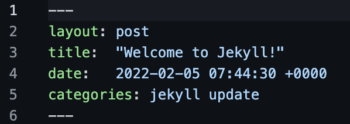

# jekyll-practice

## Notes

### Getting started with first Jekyll Project

1. Prerequisites:
    1. Ruby and Gem must be installed on your machine
    2. Install jekyll using the following commamd:

        ```gem install jekyll bundler```

2. Create a new project using the following command:

    ```jekyll new <project_name>```

3. Run the project by changing pwd to the new project directory and running the following command:

    ```bundle exec jekyll serve```

### Folder Structure

1. ```_posts``` contains the blog posts for the website.

2. ```_site``` contains the jekyll compiled static website code.

3. ```_config.yml``` contains all the attributes of the website.

4. ```404.html``` contains the html code for the Server Error 404 Page.

5. ```about.markdown``` contains the about section of the website. The content is written in the markdown language.

6. ```Gemfile``` contains the gem dependencies that the jekyll project has.

7. ```index.markdown``` contains the index page markdown.

### Understanding the blog posts inside _post

1. Default file naming convention for blog posts is: ```<date>-<post-title>.markdown```

2. Each file contains front matter.

    Front Matter occupy the first few lines of every blog post. They are enclosed in ```---```. It can either be specified in YAML or JSON format. An example is shown below:

    

    It's attributes may include the following:

    1. ```layout```: Layout specifies the type of layout that the current markdown post will have. We can create our own custom layouts and specify them here.

    2. ```title```: Title overrides the title given in the filename for that markdown post.

    3. ```date```: Date overrides the date given in the filename for that markdown post. This will also change the url for that jekyll post as date is included in the post url. (Under default settings)

    4. ```categories```: Categories defines where the page will be stored in when it is compiled. Each category might define different ways of displaying the page.

    5. ```<your-own-attribute>```: You can even define your own custom front matter attribute that you can refer to in the layouts.

3. We can create sub directories in _posts to keep it organised and it won't change anything in the project.